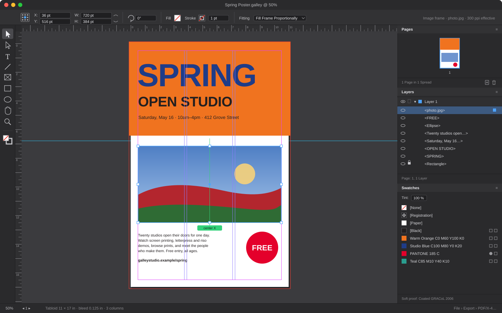
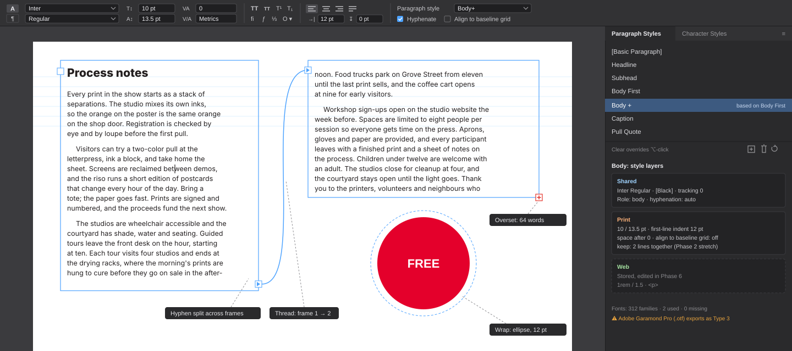
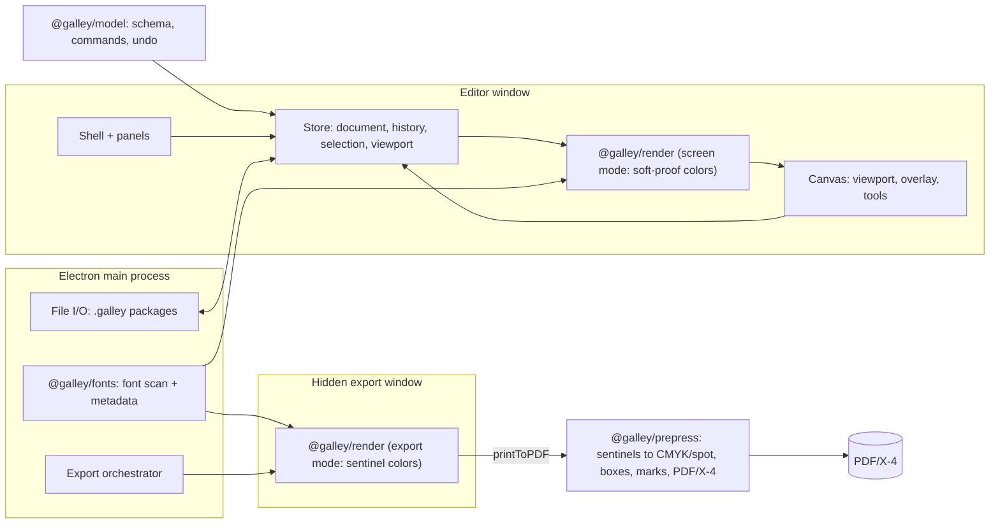
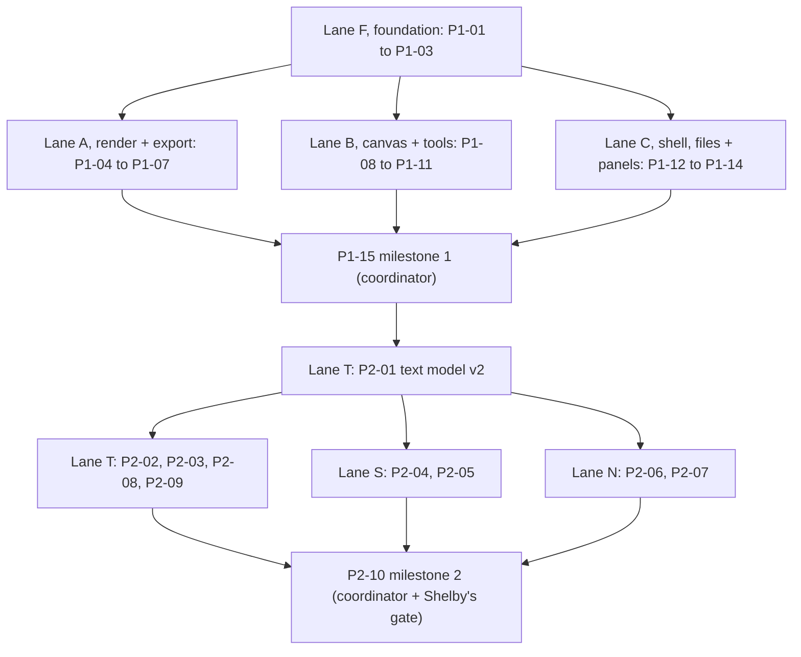

# Phases 1–2: Canvas foundation and typography

**Issue:** [shelbyklein/Galley#1](https://github.com/shelbyklein/Galley/issues/1)
**Handoff:** [phases-1-2-handoff.md](phases-1-2-handoff.md)
**Baseline:** `main` at `14cf16b`, which has PLAN.md and both Phase 0 spikes

## Summary
This plan builds the first usable version of Galley. Phase 1 delivers the InDesign-style editor shell and these features:
- pages, frames and selection tools
- snapping, layers, swatches and saved documents
- a basic press-ready PDF/X-4 export, ported from the Phase 0 print spike

Phase 2 adds typography:
- text threaded across linked frames, with live editing
- paragraph and character styles, and the font manager
- baseline grid and text wrap

At the end, you can rebuild a real one-page InDesign flyer in Galley and export it for press.

## Problem
**Current behavior.** Galley has no app.
- At `14cf16b` the repository contains only `PLAN.md` and two throwaway prototypes: `spikes/press` (PDF export) and `spikes/threading` (linked text frames).
- Neither prototype can create, save or edit a document.
- The only UI is the threading spike's demo window, a fixed test page with no tools.

**Who it affects.** Shelby (the only user, a print designer) can't lay out anything in Galley yet. Every piece of real work still has to happen in InDesign.

**Desired behavior.** A desktop app where Shelby can:
- create a document and draw, place and type content
- style the text, and thread it across frames
- save and reopen the document
- export a PDF/X-4 that a commercial printer accepts

## Visual aids

**Current state.** There is no editor yet (greenfield), so there is nothing to screenshot. The repository tree at `14cf16b` is the evidence.

**Target, Phase 1:** InDesign-style layout. A dark UI, tools on the left, a control strip on top, rulers, the pasteboard, and docked Pages, Layers and Swatches panels.

**Target, Phase 2:** type mode, with a character/paragraph control strip, threaded frames with in-ports and out-ports, an overset marker, text wrap, and a Paragraph Styles panel showing the shared, print and web style layers.

**Flow:** the editor and the exporter share one page renderer. Only the color mode differs.

**Lanes:**

## Settled decisions
- **Electron 44.5.1, pinned exactly.** Both spikes were verified on it, and the version is stored in every document as `engineVersion`.
- **Stack:** npm workspaces, TypeScript, React, Zustand + Immer (patches give undo), ProseMirror for text, Vitest, and Playwright (Electron) for end-to-end tests.
- **Units:** points throughout. Objects are stored by ID.
- **File format:** `.galley` folder packages containing `document.json`, `links.json`, `assets/` and `fonts/`. Image links use relative paths plus a hash.
- **Text frames are story-backed from Phase 1** (one story per frame, default style), so Phase 2 extends them instead of migrating them.
- **Geometry:** shapes, fills, strokes and rules are drawn as SVG for exact geometry. Page padding is a multiple of 0.24 pt, and the sheet is always clipped with `overflow: hidden`. P1-04 picks how text-frame origins are positioned exactly.
- **Export:** basic PDF/X-4 export with bleed and crop marks is in Phase 1, reusing the press spike's sentinel prepress.
- **Output profile:** read from the system. Adobe `CoatedGRACoL2006.icc` is used if present; otherwise Ghostscript's `default_cmyk.icc`, with a visible note. No profile is bundled.
- **Fonts:** any installed font is allowed.
  - Static TrueType embeds as a real font.
  - Variable fonts use the same cached static instance on screen and at export, so both use identical font bytes.
  - CFF `.otf` fonts export as Type 3, and the export dialog warns about them.
  - The Type 3 → real-font rewrite stays in Phase 4.
- **Leading:** any value is allowed. P2-08 must prove that non-0.75 pt leadings still match print. If they don't, that is a fork for Shelby.
- **Tracking:** GitHub issue checklist plus Tracker Trapper, restored by Shelby's resume instruction on 2026-10-02. The earlier GitHub-only waiver is superseded.

## Success criteria
1. **Poster milestone.** On `main`, `npm run test:milestone1` builds the poster from the Phase 1 mockup through the real UI (draw, place, type, swatches), saves it, reopens it and exports a PDF/X-4 that passes the golden separation checks:
   - K-only black text
   - the spot color on its own plate
   - swatch values within ±2%
   - bleed and trim boxes correct
   - `qpdf --check` clean
2. **Flyer milestone.** On `main`, `npm run test:milestone2` builds a styled flyer threaded through two frames, with text wrap, through the real UI, and exports it. The PDF line-match finds 0 mismatches, and `pdffonts` reports static TTF as CID TrueType and variable fonts as pre-instanced (not Type 3).
3. **Whole suite green.** After the final merge, `npm test && npm run test:e2e && npm run test:golden && npm run test:text` all exit 0 on `main`.
4. **Visual fidelity.** The coordinator captures screenshots of the running app (Phase 1 shell, type mode), inspects them against the mockups, and commits them to `docs/plans/assets/phases-1-2/screens/`, linked from the issue.
5. **Shelby's acceptance.** Shelby rebuilds a real one-page flyer from InDesign in Galley and exports it. This is Shelby's gate.

## Deliverables
| Deliverable | End state |
|---|---|
| Phase 1 and 2 code (`packages/model`, `packages/render`, `packages/prepress`, `packages/fonts`, `apps/desktop`) | Merged to `main` and pushed to `origin` |
| A runnable app (`npm run dev`) | Built locally; not packaged or installed |
| Test suites and fixtures, including golden separation and line-match harnesses | Committed, and passing on `main` |
| This plan, its handoff, and the updates to `PLAN.md` | Committed |
| App screenshots from the coordinator's verification | Committed under `docs/plans/assets/phases-1-2/screens/` |
| GitHub issue with the task checklist | Published; boxes checked as each acceptance check passes |
| Issue closure | Awaiting Shelby's approval after the P2-10 gate |

## Workflow
Tasks are in dependency order. Every acceptance check is pass/fail and runs on the lane's branch before merge, then again on `main` after merge.

### Phase 1
| ID | Lane | Task | Acceptance check |
|---|---|---|---|
| P1-01 | F | **Scaffold.** npm workspaces, TypeScript, an electron-vite (or equivalent) app with React, Electron pinned exactly to 44.5.1 (with `allowScripts`), Vitest, Playwright Electron, and an empty dark shell with four regions (tools, control strip, canvas, dock). Includes a command registry and a screenshot helper. | From a clean checkout, `npm ci && npm run build && npm test && npm run test:e2e` all exit 0. The e2e smoke screenshot shows the four regions. `node -p "require('electron/package.json').version"` prints 44.5.1, and package.json has no range on electron. |
| P1-02 | F | **Document model v1** (`@galley/model`). Types and schema for document, pages (size, margins, columns, bleed, slug), layers, guides, swatches (CMYK, spot, tint), frames (rect, ellipse, line, text, image, group), stories (ProseMirror JSON, default style) and assets. Commands with Immer patches; undo/redo with coalescing; versioned serialization (`formatVersion: 1`, `engineVersion`). | `npm test -w @galley/model` passes, including: a property test of 500+ random command sequences where undo-all then redo-all gives the original document; serialize then parse deep-equals; the schema rejects bad units and dangling IDs; a simulated drag of 50 moves is one undo step. |
| P1-03 | F | **Store and shared page renderer v1** (`@galley/render`). Zustand store over the model and history. React page renderer: sheet with bleed/slug, SVG shapes, image frames, static story text, and a screen color mode (temporary CMYK→RGB) plus an export color mode (sentinels). The editor canvas and an `export-page` entry both import it. Fixture `fixtures/poster-basic.galley`. | The e2e test opens the fixture and the screenshot matches its baseline. A unit test confirms export mode paints swatch-colored elements only with sentinel values (DOM scan finds no soft-proof colors). A grep shows both entries import `@galley/render`. |
| P1-04 | A | **Geometry precision.** Measure frame geometry in the exported PDF for SVG shapes and text-frame origins at fractional positions (e.g. x = 36.3 pt, w = 100.1 pt). Choose the text-frame positioning method (transform vs left/top vs SVG `foreignObject`) by measurement. Document the page-size quantization rule. | `npm run test:geometry` passes. SVG shape edges are within ±0.05 pt and text-frame first-baseline origins within ±0.05 pt in the PDF (parsed content stream or `pdftotext -bbox`). The chosen method and its measured error are recorded in `packages/render/GEOMETRY.md`. |
| P1-05 | A | **Prepress package** (`@galley/prepress`). Port the spike's tokenizer, rewriter, shadings, masks, images, marks, PDF/X metadata and sentinel assignment from document swatches. Add a golden separation harness (Ghostscript `tiffsep`). | `npm test -w @galley/prepress` passes (tokenizer and rewriter units). `npm run test:golden` passes on the fixture export: K-only body text, spot on its own plate, swatch values within ±2%, overprint correct, no DeviceRGB vector color, `qpdf --check` clean. |
| P1-06 | A | **Export command.** File › Export › PDF/X-4…, which runs the hidden window in export mode, then `printToPDF`, prepress and save. Options: bleed on/off, crop marks on/off. Shows progress and errors. | The e2e test exports the fixture (save dialog stubbed): the file exists, passes the `test:golden` checks, and has a TrimBox of exactly the page size. With bleed off, BleedBox equals TrimBox; with marks off, there are no `/All` separation marks. |
| P1-07 | A | **Soft proof.** CMYK and spot swatches are shown through the output profile (LittleCMS WASM, or sharp/libvips in the main process), replacing the temporary conversion. The status bar names the profile. | A unit test converts 6 reference swatches and matches Ghostscript-converted references through the same profile within ΔE00 ≤ 2. With no profile present, the app falls back to `default_cmyk.icc` and the status bar says so (e2e check). |
| P1-08 | B | **Viewport and rulers.** Pasteboard, zoom (⌘=, ⌘−, ⌘0 fit page, zoom tool), pan (space-drag, hand tool), rulers in pt/in/mm, guides dragged from rulers, and margin, column, bleed and slug guides. | e2e: ⌘0 then ⌘= changes the zoom readout to the expected values; space-drag moves the view; a guide dragged from the top ruler lands at the dropped pt position ±0.5 pt at 100%; switching units changes the ruler labels; the guides screenshot matches its baseline. |
| P1-09 | B | **Selection and transform.** Click, shift-click, marquee; move (drag, arrows 1 pt, shift 10 pt); resize (shift proportional, alt from center); rotate; group/ungroup (⌘G, ⇧⌘G); arrange (⌘], ⌘[); alt-drag duplicate; delete; copy/paste. | e2e scenarios with model assertions for each gesture. Every gesture is exactly one undo step: ⌘Z restores the prior document JSON byte-for-byte. |
| P1-10 | B | **Drawing and placing tools.** Rectangle (M), ellipse (L), line (\\), text frame (T, then type), place image (⌘D) with fitting (fill proportionally, fit proportionally, fit content to frame, center). | e2e draws each object type and asserts the model. The text frame's story contains the typed "Hello". Placing an image creates a linked asset with a relative path, and each fitting option sets the expected content transform. The canvas screenshot matches its baseline. |
| P1-11 | B | **Smart guides and snapping.** Snap to guides, margins, columns, page edges, bleed, and object edges and centers, with a screen-pixel threshold. Smart guide lines appear during drags. | Snap-engine unit tests pass. e2e: a frame dragged to within 3 screen px of a margin lands exactly on it (model assertion); a screenshot taken mid-drag shows the smart guide. |
| P1-12 | C | **Shell, menus and shortcuts.** Tools panel, control strip (object mode), docked collapsible panels, a menu bar (File, Edit, Object, Type, View, Window) built from the command registry, and InDesign default shortcuts (V A T \\ M L H Z). | e2e: the menu bar lists the expected menus and items, and each tool shortcut activates its tool (store state plus highlighted button). The coordinator compares a shell screenshot with the Phase 1 mockup. |
| P1-13 | C | **Documents and files.** New Document dialog with presets (Letter, Tabloid, A4, A3, 18×24 in, 24×36 in), margins, columns, bleed and slug. Open, Save and Save As for `.galley` packages; recent files; dirty indicator and close prompt; relative image links; missing-link placeholder and warning. | e2e: each preset creates exact pt sizes. Save As writes `X.galley/document.json` and `links.json`; reopening gives a model that deep-equals the original and an identical render screenshot. Closing a dirty document prompts. A renamed image shows the missing-link placeholder and warning. |
| P1-14 | C | **Panels.** Pages (add, delete, reorder); Layers (new, rename, reorder, hide, lock); Swatches (new CMYK or spot swatch, edit, tint, apply to fill/stroke); control strip fields (X, Y, W, H, rotation, reference point, fill, stroke, weight). | e2e: each panel action updates the model and the canvas. A hidden layer's frames are not rendered, and a locked layer's frames can't be selected. Typing X = 72 with the center reference point moves the frame's center to exactly 72 pt. |
| P1-15 | Coordinator | **Milestone 1.** Merge lanes A, C and B. A Playwright script builds the mockup poster through the real UI, saves, reopens and exports it. Commit screenshots and update the issue. | `npm run test:milestone1` passes on `main`. The coordinator inspects the screenshots against the mockup and posts the links to the issue. |

### Phase 2
| ID | Lane | Task | Acceptance check |
|---|---|---|---|
| P2-01 | T | **Text model v2.** The story schema gets paragraph-style references and local overrides, plus character-style marks. Style definitions get shared, print and web layers with `basedOn`. Also: threads (ordered frame chains), frame text-wrap settings, document baseline-grid settings, `formatVersion: 2` with a v1→v2 migration, and a minimal style→CSS resolver. | `npm test -w @galley/model` passes, including: every v1 fixture migrates and renders the same as before (screenshot equal); `basedOn` chains and overrides resolve correctly; a style cycle is rejected. |
| P2-02 | T | **Thread engine.** Port the spike engine into `packages/render/src/text/`: incremental re-threading, the overset count, and hyphenated joins. Also port its tests: boundary-biased fuzz, geometry invariants, independent per-word line extraction, and the pdftotext line-match harness. | `npm run test:text` passes: 2,000+ fuzz edits where incremental equals full; the invariants hold; median under 3 ms and p95 under 16 ms per key for an 800-word, 3-frame story; the PDF line-match has 0 mismatches over 1,000+ lines. |
| P2-03 | T | **Threading UI and editing.** Out-port and in-port linking and unlinking, View › Show Text Threads, the overset marker with word count, Type-tool caret placement, and cross-frame typing, arrows, Enter, Backspace and undo in the real app. Composition (IME) is deferred until it ends. | e2e: clicking an out-port then another frame threads them (model updated, text flows); unlinking restores the previous state; thread lines show; the overset marker reports its word count; the spike's editing scenarios pass in the real app. |
| P2-04 | S | **Styles: panels and CSS.** Paragraph Styles and Character Styles panels: new, edit, `basedOn`, apply, redefine, the `+` override indicator, and clear overrides. Full style→CSS generation for the print layer. The web layer is stored and shown read-only. | e2e: create "Body" based on "Body First" and apply it; redefining "Body" updates every use; a local change shows `+`; clear overrides removes it; a character style applies and removes. CSS snapshot unit tests cover every property. |
| P2-05 | S | **Type controls.** Character mode of the control strip: font, style, size, leading, tracking, kerning (metrics/none), case, baseline shift, and OpenType features (ligatures, small caps, oldstyle figures, fractions, stylistic sets). Paragraph mode: alignment, indents, space before/after, hyphenation and its limits, and drop caps (`initial-letter`). | e2e: each control updates the model and the rendered element's computed style. The type-specimen fixture screenshot matches its baseline. |
| P2-06 | N | **Font manager** (`@galley/fonts`). Scan the system and document font folders with fontkit (family, style, weight, format, variable axes, fsType). Font menu with style previews; `@font-face` loaded from the exact files; document fonts take priority; missing fonts are highlighted, substituted and listed. | Unit test: scanning a fixture font folder returns the expected metadata. e2e: the font menu lists system families; choosing one loads that exact file (`document.fonts` check); a document with a missing font shows the highlight and the warning list. |
| P2-07 | N | **Fonts in export.** Pre-instance variable fonts to static fonts at export (HarfBuzz subset). The export dialog warns about CFF `.otf` (Type 3). The font report goes into the export log. | Export a fixture using a static TTF, a variable TTF and a CFF OTF. `pdffonts` shows the static font as CID TrueType, the variable font as non-Type 3, and the CFF font as Type 3, and the dialog lists it. Black text is K-only in all three (`tiffsep`). |
| P2-08 | T | **Baseline grid and leading proof.** Document baseline grid (start, increment), a view toggle, and "align to baseline grid" per paragraph. Verify the print line-match at non-0.75 pt leadings. | e2e/text: aligned baselines sit on the grid within ±0.1 pt on screen and in the PDF. The PDF line-match passes at leadings of 12, 13, 13.5, 14.5 and 15.25 pt. A failure is a fork for Shelby, not something to work around silently. |
| P2-09 | T | **Text wrap.** Bounding-box and ellipse-contour wrap with offsets, done with invisible `shape-outside` floats per spike; a Text Wrap panel. Wrap is one-sided for now (documented). | e2e: an ellipse with a 12 pt wrap over a threaded frame leaves no glyph box intersecting the ellipse plus offset in the PDF (`pdftotext -bbox`). The wrap fuzz (incremental equals full) passes. Panel edits update the wrap. |
| P2-10 | Coordinator | **Milestone 2.** Merge lanes N, S and T. A Playwright script builds the styled, threaded, wrapped flyer through the UI and exports it. Commit screenshots and update the issue. Then **Shelby's gate:** rebuild a real one-page InDesign flyer in Galley and export it. | `npm run test:milestone2` and the full suite (success criterion 3) pass on `main`. The coordinator inspects the screenshots against the type-mode mockup. Shelby accepts the flyer, or files the gaps found. |

**Shelby's gates, in sequence:**
1. After P1-15, a Phase 1 review (optional; it doesn't block Phase 2).
2. At P2-10, the flyer rebuild (required for closure).
3. Closing the issue (needs Shelby's approval).

## Scope boundaries
**Excluded:**
- direct selection of anchor points
- Pen tool and Bézier paths
- gradients UI
- image cropping inside frames beyond the fitting options
- Links panel
- swatch libraries (Pantone books)
- color settings UI
- preflight panel
- parent pages, spreads and facing pages
- sections and page numbering
- fold layouts
- tables
- find/change
- Story Editor panel
- widow/orphan and keep options (stretch only)
- paragraph composer
- the web ruleset and HTML export
- IDML import
- packaging or signing a `.app`
- auto-update
- CI pipelines
- the Type 3 → real-font rewrite (Phase 4)

**Must not change:**
- `spikes/press` and `spikes/threading` stay as reference material, untouched. Code is copied from them, not moved.
- The Phase 0 findings documents.
- The settled decisions in `PLAN.md`.

## Rollback
No user data, installs or external services are involved. Each lane lands as its own `--no-ff` merge commit on `main`, so it can be reverted alone with `git revert -m 1 <merge-sha>`. File format v1→v2 is a one-way migration, but no real documents exist yet, and the v1 fixtures stay in the repo for migration tests. Before each merge, the coordinator records the pre-merge `main` SHA in the issue.

## Test plan
| Suite | Command | Covers |
|---|---|---|
| Unit | `npm test` | Vitest across packages: model, render (non-DOM), prepress, fonts, snap engine, style→CSS |
| End-to-end | `npm run test:e2e` | Playwright `_electron` launching the real app entry (`apps/desktop` main process, editor window) and driving menus, shortcuts, tools and panels. Screenshot baselines live in `apps/desktop/e2e/__screenshots__/`. |
| Golden print | `npm run test:golden` | Fixture exports, then Ghostscript `tiffsep` plate measurements, `qpdf --check` and `pdffonts` |
| Text | `npm run test:text` | Thread fuzz, invariants, performance budget, and the pdftotext line-match |
| Geometry | `npm run test:geometry` | Exact PDF geometry for shapes and text-frame origins |
| Milestones | `npm run test:milestone1`, `npm run test:milestone2` | UI-built poster and flyer, from start to exported PDF |

**Rendered-state checks.** The coordinator launches the real app through Playwright at each milestone, captures the shell, the canvas with a selection, and type mode, and reads the images to compare them against the two mockups. Passing tests alone don't count as visual sign-off.

**Required tools:** Ghostscript, poppler (`pdftotext`, `pdffonts`) and `qpdf`, all installed on this Mac.

## Open decisions and questions
1. What does Shelby's print shop say about Type 3 fonts? This sets how urgent the Phase 4 rewrite is.
2. ICC profile licensing for any future distribution. For now the system profile is used and nothing is bundled.
3. Which real flyer to rebuild at the P2-10 gate? Shelby picks it at the gate.
4. How common is justified body text in Shelby's work? This affects later work on composition quality.
5. **P2-05 scope decision pending:** Chromium supports the minimum word and break lengths, but does not implement the consecutive-hyphen-line limit. Shelby has been asked whether to defer that control or expand scope beyond the excluded custom composer. The control is disabled and this task remains incomplete until that decision and its resulting acceptance checks are resolved.

## Work preparation
- **Scope:** confirmed by Shelby on 2026-10-01 ("see if you can get to the end of phase 2"). Phase 1 scope as listed in chat, including basic PDF export (Shelby chose "Yes, basic export"), InDesign layout (Shelby chose "Familiar InDesign layout"), and Phase 2 per `PLAN.md`.
- **Plan:** this file.
- **Mode:** `orchestrated`. Reason: three disjoint Phase 2 lanes can run in parallel. Shelby originally requested Sonnet, then explicitly requested GPT-6.1 Sol for this resume.
- **Models:**
  - Current coordinator: GPT-6.1 Sol (`gpt-6.1-sol`), xhigh effort, verified from this session's runtime metadata.
  - Resumed lanes T, S, N: GPT-6.1 Sol (`gpt-6.1-sol`), xhigh effort for T and high effort for S/N, via Codex collaboration in their existing isolated worktrees.
  - Historical completed lanes used Opus 5.5 / Sonnet; their commits and evidence are preserved. No further Claude-powered work is authorized.
- **Handoff:** [phases-1-2-handoff.md](phases-1-2-handoff.md) (prepared).
- **Now or later:** now. Shelby's instruction was "see if you can get to the end of phase 2".
- **Tracker:** Tracker Trapper is restored for this resume; stable todo IDs mirror the 25 issue task IDs. Plan ID: `220A01DC-5B7A-4C21-808C-C75CA4CAD1EA`.
- **Readiness:** pass · 2026-10-01 · R3: current state is greenfield (no UI to screenshot; repository tree at `14cf16b` is the evidence), target mockups and flow diagrams present · R7: Tracker Trapper waived by Shelby in chat (GitHub issue only); the issue checklist matches the 25 task IDs · R12: covered by per-lane merge reverts; no user data, installs or services
- **Remaining questions:** see Open decisions and questions. The P2-05 decision and real-flyer acceptance gate remain; other lanes continue independently.

## Resume audit, 2026-10-02
- Clean `main`: `dac614c`; Phase 1 and P2-01 accepted (16/25 issue boxes).
- Galley Claude host PID 16061 identified by cwd and terminated; unrelated Claude sessions preserved.
- Existing lane T worktree: `.claude/worktrees/agent-a7f68809a1f855a7a`.
- Existing lane S worktree: `.claude/worktrees/agent-a218bfc0fd80bf96b`.
- Existing lane N worktree: `.claude/worktrees/agent-a994c5ad4bf5844ef`.
- All three start at `dac614c` and are clean. Their old JSONL instructions and research remain available; no new lane commits were ready for merge.
- Coordinator owns GitHub and integration; each resumed lane reports its own Tracker Trapper run and acceptance evidence.

- **Resume readiness:** pass · 2026-10-02 · R1-R13 rechecked; current UI evidence is `assets/phases-1-2/screens/milestone1/06-finished-poster.png`, target type-mode mockup and flow remain linked; R7 restored with plan `220A01DC-5B7A-4C21-808C-C75CA4CAD1EA`; R9 current model and efforts verified/named. Original scope and human flyer/closure gates remain.
